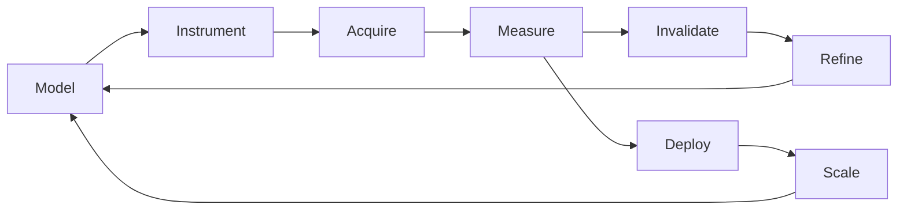
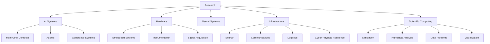

<div align="center">

# DANIEL J. MUELLER

### AI SYSTEMS · SCIENTIFIC COMPUTING · HARDWARE · INFRASTRUCTURE · NEURAL SYSTEMS


[GitHub](https://github.com/Daniel-J-Mueller) ·
[Untitled-7](https://www.untitled-7.com) ·
[Resume](./Resume%20-%20Daniel%20J.%20Mueller%20-%202026.pdf)

</div>

---

```text
DANIEL J. MUELLER // TECHNICAL PROFILE

RESEARCH MODE
    Cross-domain engineering focused on systems that can be built, instrumented,
    measured, stress-tested, and reduced to first-principles behavior.

PRIMARY SURFACES
    Artificial intelligence · scientific computing · embedded hardware · neural systems
    infrastructure analysis · data engineering · simulation · experimental instrumentation

COMPUTE
    ORION workstation
    3 × NVIDIA A100 40 GB
    1 × NVIDIA RTX A6000
    256 GB system memory
    Ubuntu / CUDA / local multi-GPU inference and scientific workloads

WORKING RANGE
    microcontroller-scale instrumentation
        ↓
    embedded sensing + signal acquisition
        ↓
    GPU-accelerated model systems
        ↓
    large-scale data pipelines + visualization
        ↓
    national infrastructure and dependency analysis
```

---

## TECHNICAL OPERATING MODEL

Most work is organized around one constraint: **the system must survive measurement**.

Research therefore converges on a closed engineering loop:



The implementation layer spans **Python, Linux, CUDA, embedded systems, local model serving, numerical analysis, simulation, browser visualization, data pipelines, and experimental control**. Work is biased toward systems where software, hardware, physical behavior, and data all interact.

---

## SYSTEM CAPABILITIES

<table>
<tr>
<td width="50%" valign="top">

### AI / COMPUTE

Local multi-GPU AI infrastructure built around A100-class accelerators for inference, experimentation, model serving, agent systems, and generative workflows.

```text
GPU FABRIC      3 × A100 40 GB
DISPLAY         RTX A6000
RAM             256 GB
OS              Ubuntu
ACCELERATION    CUDA
WORKLOADS       inference / simulation / generation / evaluation
```

The emphasis is not API composition. It is **owning the compute path**: runtime behavior, memory pressure, accelerator allocation, model topology, orchestration, and failure modes.

</td>
<td width="50%" valign="top">

### HARDWARE / INSTRUMENTATION

Embedded systems are treated as experimental instruments rather than peripheral devices.

```text
MCU             ESP32-S3 class
CONTROL         serial / deterministic command paths
SIGNALS         ADC / digital acquisition / timing
DESIGN BIAS     isolated / measurable / reproducible
OUTPUT          raw measurements → analysis pipeline
```

Typical work crosses firmware, electronics, sensing, timing, isolation, calibration, and host-side analysis.

</td>
</tr>

<tr>
<td width="50%" valign="top">

### DATA / SCIENTIFIC SOFTWARE

Large datasets are converted into inspectable research surfaces rather than static archives.

```text
PIPELINE        ingest → normalize → partition → analyze → visualize
LANGUAGE        Python
OUTPUTS         CSV / JSON / browser views / derived datasets
SCALE           hundreds of thousands of records and above
```

Design priorities: reproducibility, explicit schemas, inspectable transformations, and keeping source data close to analytical outputs.

</td>
<td width="50%" valign="top">

### INFRASTRUCTURE / SYSTEMS

Research focuses on **interdependence**, **failure propagation**, **resilience**, and **cross-domain coupling** in large technical systems.

```text
ENERGY          grid / generation / fuel
COMMS           telecom / cloud / backbone
LOGISTICS       ports / rail / freight / supply chains
CIVIC           water / healthcare / government
CYBER-PHYSICAL  dependency and resilience analysis
```

The relevant unit of analysis is usually not an isolated asset. It is the **graph of dependencies around it**.

</td>
</tr>
</table>

---

## PUBLIC RESEARCH SURFACES

### [`National-Security-Research`](https://github.com/Daniel-J-Mueller/National-Security-Research)

A systems-level research environment for national infrastructure, public-impact risk, environmental outputs, and cyber-physical resilience.

The repository combines sector analysis with data tooling across electric power, generation, energy supply chains, communications, water, transportation, healthcare, finance, government systems, agriculture, and defensive cybersecurity.

```text
DATA                 public + derived datasets
ANALYSIS             dependency / resilience / emissions / system risk
VISUALIZATION        local browser-based geospatial interfaces
CYBER                defensive version categorization and hardening workflows
PIPELINES             category-scoped ETL and structured outputs
RESEARCH UNIT         systems and dependencies, not isolated components
```

---

### [`US_Town_Halls`](https://github.com/Daniel-J-Mueller/US_Town_Halls)

A national municipal-data pipeline built to normalize, partition, and visualize U.S. town-hall records at operational scale.

```text
RECORDS              473,210
SOURCE FORMAT         CSV
PROCESSING            Python
PARTITIONING          national / state / chunked
VISUALIZATION         browser-based geographic interface
PIPELINE              merge / clean / normalize / export
```

This is representative of a recurring pattern: **take unstructured or awkward source data, make the transformation path explicit, and produce something directly usable by humans and machines.**

---

## RESEARCH DOMAINS

```text
ARTIFICIAL INTELLIGENCE
    local inference
    agent architectures
    multi-GPU systems
    model evaluation
    generative systems
    AI infrastructure

NEURAL / BIOLOGICAL SYSTEMS
    brain research
    signal acquisition
    neural interfaces
    experimental instrumentation
    biological system modeling

SCIENTIFIC / TECHNICAL COMPUTING
    simulation
    numerical analysis
    signal processing
    automated experiments
    measurement pipelines
    reproducible analysis

HARDWARE
    embedded systems
    electronics
    sensing
    instrumentation
    compute architecture
    physical-system integration

INFRASTRUCTURE
    electric power
    communications
    logistics
    transportation
    resilience
    cyber-physical dependencies
    cascading failure analysis

SOFTWARE / DATA
    Python
    Linux
    CUDA
    automation
    visualization
    ETL
    local services
    research tooling
```

---

## ENGINEERING STACK

<div align="center">


</div>

---

## CURRENT SYSTEM MAP



---

## FILES

| RESOURCE | ACCESS |
|---|---|
| Resume — Daniel J. Mueller — 2026 | [PDF](./Resume%20-%20Daniel%20J.%20Mueller%20-%202026.pdf) |
| Societal Progression — Part I | [PDF](./Societal_Progression_part1.pdf) |
| National Infrastructure Research | [Repository](https://github.com/Daniel-J-Mueller/National-Security-Research) |
| U.S. Town Halls Dataset | [Repository](https://github.com/Daniel-J-Mueller/US_Town_Halls) |
| Untitled-7 | [Console](https://www.untitled-7.com) |

---

<div align="center">

### BRAIN RESEARCH. TIME TRAVEL IS COOL.

</div>
