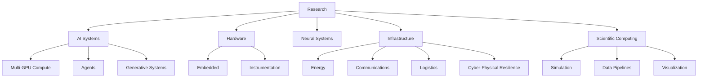

<div align="center">

# DANIEL J. MUELLER

### RESEARCH / SYSTEMS / AI / HARDWARE / INFRASTRUCTURE


[GitHub](https://github.com/Daniel-J-Mueller) · [Untitled-7](https://www.untitled-7.com) · [Resume](./Resume%20-%20Daniel%20J.%20Mueller%20-%202026.pdf)

</div>

---

## PROFILE

```text
> operator.spec

PRIMARY WORK    deep-tech research and engineering
DOMAINS         AI / neural systems / hardware / software / infrastructure / biology / energy / data
METHOD          build / instrument / test / measure / iterate
OUTPUT          software / datasets / experimental systems / technical research
SCALE           embedded hardware -> multi-GPU compute -> national-scale datasets
```

---

## COMPUTE

```text
> system.compute

WORKSTATION     ORION
MEMORY          256 GB
ACCELERATORS    3× NVIDIA A100 40 GB
DISPLAY GPU     NVIDIA RTX A6000
OS              Ubuntu
WORKLOADS       AI inference / training / simulation / scientific compute
```

---

## ACTIVE TECHNICAL AREAS

```text
> system.areas

ARTIFICIAL INTELLIGENCE
  model systems
  agent architectures
  local inference
  multi-GPU compute
  evaluation
  applied automation

NEURAL / BIOLOGICAL SYSTEMS
  brain research
  neural interfaces
  signal acquisition
  biological systems
  experimental instrumentation

HARDWARE
  embedded systems
  electronics
  sensing
  instrumentation
  compute architecture

INFRASTRUCTURE
  power
  communications
  logistics
  transportation
  resilience
  dependency analysis
  cyber-physical systems

SOFTWARE / DATA
  Python
  automation
  simulation
  visualization
  large-scale datasets
  research tooling
```

---

## PUBLIC SYSTEMS

### National Infrastructure Research

[National-Security-Research](https://github.com/Daniel-J-Mueller/National-Security-Research)

```text
> repo.summary national-security-research

SCOPE
  electric grid
  power generation
  energy supply chains
  communications
  water systems
  transportation
  healthcare
  finance
  government systems
  agriculture
  cyber-physical resilience

TOOLS
  data pipelines
  geospatial visualization
  emissions datasets
  infrastructure dependency mapping
  defensive service analysis
```

### U.S. Town Halls Dataset

[US_Town_Halls](https://github.com/Daniel-J-Mueller/US_Town_Halls)

```text
> repo.summary us_town_halls

RECORDS         473,210
FORMAT          CSV
PROCESSING      Python
EXPORTS         national / state-scoped / chunked
VISUALIZATION   browser-based geographic view
```

---

## EXPERIMENTAL SYSTEMS

```text
> system.experimental

RANDOMNESS / ISOLATION EXPERIMENTS
  hardware RNG
  ESP32-S3 instrumentation
  air-gapped test design
  deterministic preflight
  aggregate-only result handling

AI VIDEO / GENERATIVE SYSTEMS
  multi-GPU inference
  local model serving
  scene generation
  reference-conditioned video
  distributed accelerator workflows
```

---

## ENGINEERING STACK

<div align="center">


</div>

---

## SYSTEM MAP



---

## SELECTED FILES

| RESOURCE | LINK |
|---|---|
| Resume | [PDF](./Resume%20-%20Daniel%20J.%20Mueller%20-%202026.pdf) |
| Societal Progression — Part I | [PDF](./Societal_Progression_part1.pdf) |
| National Infrastructure Research | [Repository](https://github.com/Daniel-J-Mueller/National-Security-Research) |
| U.S. Town Halls Dataset | [Repository](https://github.com/Daniel-J-Mueller/US_Town_Halls) |
| Untitled-7 | [Console](https://www.untitled-7.com) |

---

<div align="center">

### BRAIN RESEARCH. TIME TRAVEL IS COOL.

</div>
